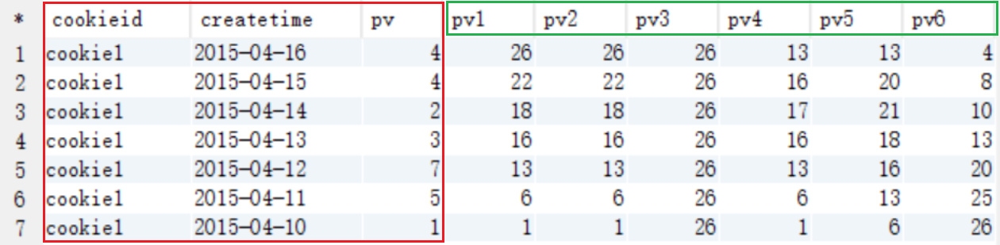
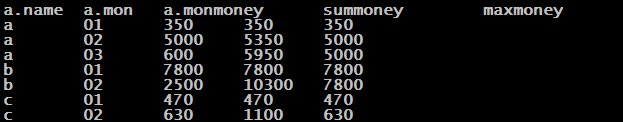

# Hive_interview-question
总结典型的hive面试题
## 需求分类：
    窗口分析
    自连接
    group by
    行列转换
    求TopN


## 窗口分析

### 窗口函数——聚合「sum\max\min\avg」

以SUM为例子：（max、min、avg同理）

 sum(求和字段) over (partition by 分组字段 order by 排序字段 **rows between** <u>unbounded preceding</u> **and** <u>current row</u>) as pv1

| **如果不指定** **rows** **between** | **默认为从起点到当前行;**     |
| ----------------------------------- | ------------------------- |
| **如果不指定** **order**  **by**    | **则将分组内所有值累加;** |

关键是理解ROWS BETWEEN含义,也叫做WINDOW子句：

| **preceding：往前**     | <u>3 preceding（前三行）</u>     |
| ----------------------- | -------------------------------- |
| **following：往后**     | **<u>1 following</u>（后一行）** |
| **current row：当前行** | **<u>current row</u>（当前行）** |

| **<u>unbounded preceding.</u>           (表示从前面的起点)** |      |
| ------------------------------------------------------------ | ---- |
| **<u>unbounded following</u>.           (表示到后面的终点)** |      |

示例：

```sql

   sum(pv) over (partition by cookieid order by createtime rows between unbounded preceding and current row) as pv1, 
   sum(pv) over (partition by cookieid order by createtime) as pv2, 
   sum(pv) over (partition by cookieid) as pv3, 
   sum(pv) over (partition by cookieid order by createtime rows between 3 preceding and current row) as pv4, 
   sum(pv) over (partition by cookieid order by createtime rows between 3 preceding and 1 following) as pv5, 
   sum(pv) over (partition by cookieid order by createtime rows between current row and unbounded following) as pv6

```



<u>**注意看，rows between 之后的内容与统计出来的结果。（多理解一下）**</u>

### 第一道面试题

- 需求：编写Hive的HQL语句求出每个店铺的当月销售额和累计到当月的总销售额

- 元数据. (name，month，money)

  ```
  a,01,150
  a,01,200
  b,01,1000
  b,01,800
  c,01,250
  c,01,220
  b,01,6000
  a,02,2000
  a,02,3000
  b,02,1000
  b,02,1500
  c,02,350
  c,02,280
  a,03,350
  a,03,250
  ```

- 建表、导入数据

  ```sql
  create table fangwen2(name string,mon string,monmoney int) row format delimited fields terminated by ",";
  
  load data local inpath "/home/hadoop/hivedata2/fangwen2" into table fangwen2;
  ```

- 查询语句

- ```sql
  select a.name,a.mon,a.monmoney,
  sum(a.monmoney) over(partition by a.name order by a.mon ) as summoney,
  max(a.monmoney) over(partition by a.name order by a.mon rows between unbounded preceding and current row) as maxmoney
  from
  (select name,mon,sum(money) as monmoney from sale group by name,mon) a;
  
  ```

- 查询结果展示

  

