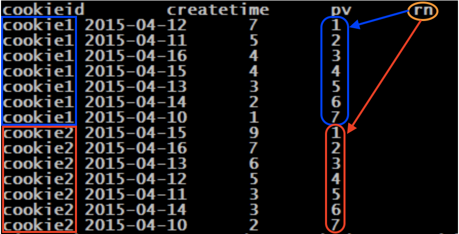
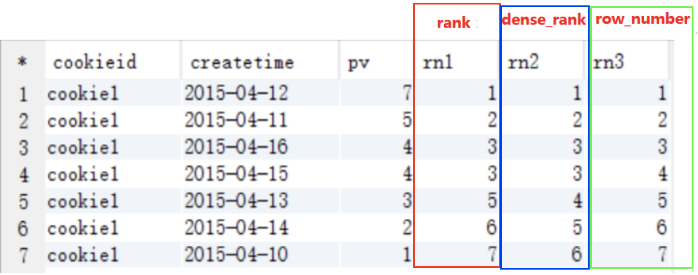

### 窗口函数-几个序列函数

#### 初识row_number()函数

- **函数语法:** row_number()  over(**partition by**分组字段 **order by**排序字段 **desc**) as rn

- 解释：指定分组字段、排序字段以及排序规则，返回分组内排序。

- 应用场景：常常用来排序后，筛选出topN。

- 事例：

  数据格式：（cookieid string, createtime string, pv int）

```
cookie1,2015-04-10,1
cookie1,2015-04-11,5
cookie1,2015-04-12,7
cookie1,2015-04-13,3
cookie1,2015-04-14,2
cookie1,2015-04-15,4
cookie1,2015-04-16,4
cookie2,2015-04-10,2
cookie2,2015-04-11,3
cookie2,2015-04-12,5
cookie2,2015-04-13,6
cookie2,2015-04-14,3
cookie2,2015-04-15,9
cookie2,2015-04-16,7
```

​		创建表、导入数据：

```sql
create table cookie(cookieid string, createtime string, pv int) row format delimited fields terminated by ',';
load data local inpath "/home/hadoop/cookie.txt" into table cookie;
```

​		查询语句：

```sql
select
  cookieid,
  createtime,
  pv,
  row_number() over (partition by cookieid order by pv desc) as rn
from 
	cookie2;
```

​		查询结果：

​		按照cookie1、cookie2分为了两组，组内分别按照<u>访问量pv</u>排序



​			

#### 几种常用的序列函数比较「row_number()、rank()、dense_rank()」

- 语法结构：

  ```sql
  row_number() over(partition by 分组字段 order by 排序字段  desc/asc) as rn
  rank() over(partition by 分组字段 order by 排序字段  desc/asc) as rn
  dense_rank() over(partition by 分组字段 order by 排序字段  desc/asc) as rn
  ```

- 用法：row_number()基本一致，不同地方如下表所示

| row_number： 按**顺序**编号，**不留空位** | （**重复也按顺序写下去**） |
| ----------------------------------------- | -------------------------- |
|                                           | 1-2-3-4-5....              |

 

| rank： 按**顺序**编号，**相同**的值编相**同号**，**留空位** | （**并列第一，就没有第二了**） |
| ----------------------------------------------------------- | ------------------------------ |
|                                                             | 1-1-3-4-5....                  |

 

| dense_rank： 按**顺序**编号，**相同**的值编**相同的号**，**不留**空位 | **（并列第一，接下来第二）** |
| ------------------------------------------------------------ | ---------------------------- |
|                                                              | 1-1-2-3-4....                |





