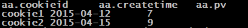
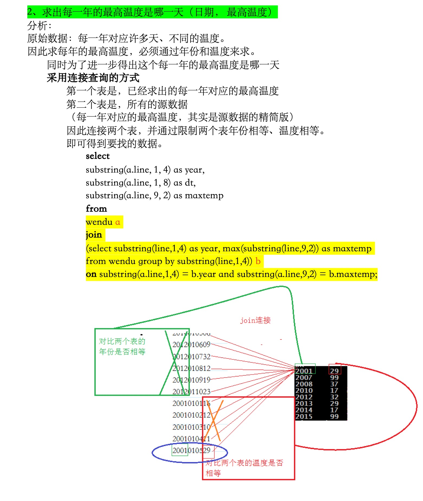

### 窗口函数-几个序列函数

#### 初识row_number()函数

- **函数语法:** row_number()  over(**partition by**分组字段 **order by**排序字段 **desc**) as rn

- 解释：指定分组字段、排序字段以及排序规则，返回分组内排序。

- 应用场景：常常用来排序后，筛选出topN。

- 事例：

  数据格式：（cookieid string, createtime string, pv int）

```
cookie1,2015-04-10,1
cookie1,2015-04-11,5
cookie1,2015-04-12,7
cookie1,2015-04-13,3
cookie1,2015-04-14,2
cookie1,2015-04-15,4
cookie1,2015-04-16,4
cookie2,2015-04-10,2
cookie2,2015-04-11,3
cookie2,2015-04-12,5
cookie2,2015-04-13,6
cookie2,2015-04-14,3
cookie2,2015-04-15,9
cookie2,2015-04-16,7
```

​		创建表、导入数据：

```sql
create table cookie(cookieid string, createtime string, pv int) row format delimited fields terminated by ',';
load data local inpath "/home/hadoop/cookie.txt" into table cookie;
```

​		查询语句：

```sql
select
  cookieid,
  createtime,
  pv,
  row_number() over (partition by cookieid order by pv desc) as rn
from 
	cookie2;
```

​		查询结果：

​		按照cookie1、cookie2分为了两组，组内分别按照<u>访问量pv</u>排序


​		进一步求每一组的top 1访问记录：

```sql
select aa.cookieid,aa.createtime,aa.pv
from
(select
  cookieid,
  createtime,
  pv,
  row_number() over (partition by cookieid order by pv desc) as rn
from cookie2) aa
where rn=1;
```

​		结果：



​			

#### 几种常用的序列函数比较

##### row_number()

##### rank()

##### dense_rank()

- 语法结构：

  ```sql
  row_number() over(partition by 分组字段 order by 排序字段  desc/asc) as rn
  rank() over(partition by 分组字段 order by 排序字段  desc/asc) as rn
  dense_rank() over(partition by 分组字段 order by 排序字段  desc/asc) as rn
  ```

- 用法：row_number()基本一致，不同地方如下表所示

| row_number： 按**顺序**编号，**不留空位** | （**重复也按顺序写下去**） |
| ----------------------------------------- | -------------------------- |
|                                           | 1-2-3-4-5....              |

 

| rank： 按**顺序**编号，**相同**的值编相**同号**，**留空位** | （**并列第一，就没有第二了**） |
| ----------------------------------------------------------- | ------------------------------ |
|                                                             | 1-1-3-4-5....                  |

 

| dense_rank： 按**顺序**编号，**相同**的值编**相同的号**，**不留**空位 | **（并列第一，接下来第二）** |
| ------------------------------------------------------------ | ---------------------------- |
|                                                              | 1-1-2-3-4....                |


### 第五道面试题

#### 需求、数据、建表等

- 需求：编写Hive的HQL语句

  1、求出每一年的最高温度（年份，最高温度）

  2、求出每一年的最高温度是那一天（日期， 最高温度）

- 元数据. (line-String)

  比如：2010012325表示在2010年01月23日的气温为25度。

  ```
  2014010114
  2014010216
  2014010317
  2014010410
  2014010506
  2012010609
  2012010732
  2012010812
  2012010919
  2012011023
  2001010116
  2001010212
  2001010310
  2001010411
  2001010529
  2013010619
  2013010722
  2013010812
  2013010929
  2013011023
  2008010105
  2008010216
  2008010337
  2008010414
  2008010516
  2007010619
  2007010712
  2007010812
  2007010999
  2007011023
  2010010114
  2010010216
  2010010317
  2010010410
  2010010506
  2015010649
  2015010722
  2015010812
  2015010999
  2015011023
  ```

- 建表、导入数据

  ```sql
  create table if not exists wendu(line string) row format delimited fields terminated by ",";
  
  load data local inpath "/home/hadoop/wendu.txt" into table wendu;
  ```

#### 思路与实现步骤

- 思路

  原数据格式是string类型，因此我们需要用到<u>字符串分割</u>函数「substring（）」，将数据分割。

  | substring(字符串，起始位置，截取长度) | 起始位置从1开始计算 |
  | ------------------------------------- | ------------------- |
  | substring(2015011023,1,4)             | 2015                |

- 实现步骤

  - 第一题

    求出每一年的最高温度（年份，最高温度）

    ```sql
    select substring(line,1,4) as years,max(substring(line,9)) as max_cc from wendu group by substring(line,1,4);
    
    ```

    

  - 第二题

    求出每一年的最高温度是那一天（日期， 最高温度）

    ```sql
    select bb.year as year, bb.dt as dt, bb.temp as maptemp 
    from 
    	(
    		select 
    		aa.year as year, 
    		aa.dt as dt,
    		aa.temp as temp, 
    		row_number() over (partition by aa.year order by aa.temp desc) as index 
    		from
    			(
    			select 
    			substring(a.line,1,4) as year,
    			substring(a.line, 1, 8) as dt,
    			substring(a.line, 9, 2) as temp  
    			from wendu a 
    			) aa
    ) bb where bb.index <= 1;
    ```

    <u>最内层循环</u>---将字符串分隔成「年、月日、温度」

    <u>第二层循环</u>---利用row_number()函数，查询「年、月日、温度、排序（排序按年分组，按温度高低排序）」

    <u>最外层循环</u>---查询结果，并使用where限制需要查询的温度「topN就where index<=n」

**第二题的另一种解法：连接查询**

这里给出简要思路不在赘述。（如图）

