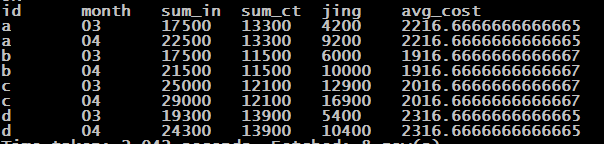
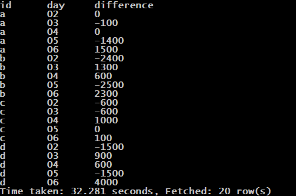
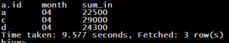
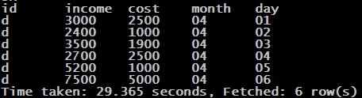

### 第十道面试题

#### 需求、数据、建表等

- 需求：编写Hive的HQL语句

  1. 输出每个产品，在2018年期间，每个月的净利润，日均成本。
  2. 输出每个产品，在2018年3月中每一天与上一天相比，成本的变化。
  3. 输出2018年4月，有多少个产品总收入大于22000元，必须用一句SQL语句实现，且不允许使用关联表查询、子查询。
  4. 输出2018年4月，总收入最高的那个产品，每日的收入，成本，过程使用over()函数。

- 元数据. ( 日期，产品id，产品当日收入，产品当日成本 )

  ```
  2018-03-01,a,3000,2500
  2018-03-01,b,4000,3200
  2018-03-01,c,3200,2400
  2018-03-01,d,3000,2500
  2018-03-02,a,3000,2500
  2018-03-02,b,1500,800
  2018-03-02,c,2600,1800
  2018-03-02,d,2400,1000
  2018-03-03,a,3100,2400
  2018-03-03,b,2500,2100
  2018-03-03,c,4000,1200
  2018-03-03,d,2500,1900
  2018-03-04,a,2800,2400
  2018-03-04,b,3200,2700
  2018-03-04,c,2900,2200
  2018-03-04,d,2700,2500
  2018-03-05,a,2700,1000
  2018-03-05,b,1800,200
  2018-03-05,c,5600,2200
  2018-03-05,d,1200,1000
  2018-03-06,a,2900,2500
  2018-03-06,b,4500,2500
  2018-03-06,c,6700,2300
  2018-03-06,d,7500,5000
  2018-04-01,a,3000,2500
  2018-04-01,b,4000,3200
  2018-04-01,c,3200,2400
  2018-04-01,d,3000,2500
  2018-04-02,a,3000,2500
  2018-04-02,b,1500,800
  2018-04-02,c,4600,1800
  2018-04-02,d,2400,1000
  2018-04-03,a,6100,2400
  2018-04-03,b,4500,2100
  2018-04-03,c,6000,1200
  2018-04-03,d,3500,1900
  2018-04-04,a,2800,2400
  2018-04-04,b,3200,2700
  2018-04-04,c,2900,2200
  2018-04-04,d,2700,2500
  2018-04-05,a,4700,1000
  2018-04-05,b,3800,200
  2018-04-05,c,5600,2200
  2018-04-05,d,5200,1000
  2018-04-06,a,2900,2500
  2018-04-06,b,4500,2500
  2018-04-06,c,6700,2300
  2018-04-06,d,7500,5000
  ```

- 建表、导入数据

  ```sql
  create table if not exists goods(dt string, name string, income int, cost int) row format delimited fields terminated by ','; 
  --建表
  load data local inpath '/home/hadoop/goods.txt' into table goods;
  --导入数据
  ```

#### 思路与实现步骤

- 思路分析

  ​	聚合函数+group by

- 实现步骤

1. 输出每个产品，在2018年期间，每个月的净利润，日均成本。

   语句：

   ```sql
   select a.id as id,a.month as month,sum(income) as sum_in,sum(a.cost) as sum_ct,(sum(income)-sum(a.cost)) as jing,avg(a.cost) as avg_cost
   from
   (
   select id,income,cost,substring(p_date,1,4) as year,substring(p_date,6,2) as month,substring(p_date,9,2) as day
   from product
   where substring(p_date,1,4)='2018'
   order by id,month,day 
   ) a
   group by a.id,a.month;
   ```

   结果：

   

2. 输出每个产品，在2018年3月中每一天与上一天相比，成本的变化。

   语句：

   ```sql
   select aa.aid as id,aa.bday as day,(aa.bcost-aa.acost) as difference
   from
   (
   select a.id as aid,a.cost as acost,a.day as aday,b.cost as bcost,b.day as bday from 
   (
   select id,income,cost,substring(p_date,1,4) as year,substring(p_date,6,2) as month,substring(p_date,9,2) as day
   from product
   where substring(p_date,6,2)='03' and substring(p_date,1,4)='2018'
   order by id,month,day
   ) a
   left join
   (
   select id,income,cost,substring(p_date,1,4) as year,substring(p_date,6,2) as month,substring(p_date,9,2) as day
   from product
   where substring(p_date,6,2)='03' and substring(p_date,1,4)='2018'
   order by id,month,day
   ) b
   on a.id=b.id and a.month=b.month and a.day=b.day-1
   ) aa
   where aa.bcost is not null;
   ```

   结果：

   

3. 输出2018年4月，有多少个产品总收入大于22000元，必须用一句SQL语句实现，且不允许使用关联表查询、子查询。

   语句：

   ```sql
   select a.id,substring(a.p_date,6,2) as month,sum(a.income) as sum_in
   from product a
   where substring(p_date,1,4)='2018' and substring(p_date,6,2)='04'
   group by id,substring(a.p_date,6,2)
   having  sum_in>22000
   order by id,month 
   ```

   结果：

   

   

4. 输出2018年4月，总收入最高的那个产品，每日的收入，成本，过程使用over()函数。

   语句：

   ```sql
   select a.id as id,a.income as income,a.cost as cost,a.month as month,a.day as day
   from
   (
   select id,income,cost,substring(p_date,6,2) as month,substring(p_date,9,2) as day
   from product
   where substring(p_date,6,2)='04' and substring(p_date,1,4)='2018'
   order by id,month,day 
   ) a
   join 
   (
   select id,income,
   row_number() over(order by income desc) as index
   from product
   where substring(p_date,6,2)='04' and substring(p_date,1,4)='2018'
   ) b
   on a.id =b.id 
   where b.index=1
   ```

   结果：

   

   

