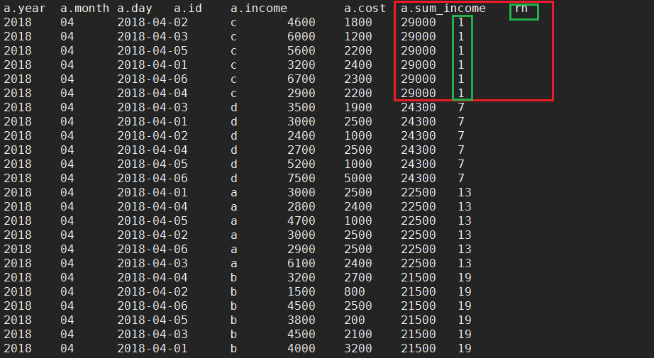

# group by

## 第十道面试题

### 需求、数据、建表等

#### 需求

编写Hive的HQL语句：

1. 输出每个产品，在2018年期间，每个月的净利润，日均成本。
2. 输出每个产品，在2018年3月中每一天与上一天相比，成本的变化。
3. 输出2018年4月，有多少个产品总收入大于22000元，必须用一句SQL语句实现，且不允许使用关联表查询、子查询。
4. 输出2018年4月，总收入最高的那个产品，每日的收入，成本，过程使用over()函数。

- 数据： ( 日期dt，产品id，当日收入income，当日成本cost )

  ```
  2018-03-01,a,3000,2500
  2018-03-01,b,4000,3200
  2018-03-01,c,3200,2400
  2018-03-01,d,3000,2500
  2018-03-02,a,3000,2500
  2018-03-02,b,1500,800
  2018-03-02,c,2600,1800
  2018-03-02,d,2400,1000
  2018-03-03,a,3100,2400
  2018-03-03,b,2500,2100
  2018-03-03,c,4000,1200
  2018-03-03,d,2500,1900
  2018-03-04,a,2800,2400
  2018-03-04,b,3200,2700
  2018-03-04,c,2900,2200
  2018-03-04,d,2700,2500
  2018-03-05,a,2700,1000
  2018-03-05,b,1800,200
  2018-03-05,c,5600,2200
  2018-03-05,d,1200,1000
  2018-03-06,a,2900,2500
  2018-03-06,b,4500,2500
  2018-03-06,c,6700,2300
  2018-03-06,d,7500,5000
  2018-04-01,a,3000,2500
  2018-04-01,b,4000,3200
  2018-04-01,c,3200,2400
  2018-04-01,d,3000,2500
  2018-04-02,a,3000,2500
  2018-04-02,b,1500,800
  2018-04-02,c,4600,1800
  2018-04-02,d,2400,1000
  2018-04-03,a,6100,2400
  2018-04-03,b,4500,2100
  2018-04-03,c,6000,1200
  2018-04-03,d,3500,1900
  2018-04-04,a,2800,2400
  2018-04-04,b,3200,2700
  2018-04-04,c,2900,2200
  2018-04-04,d,2700,2500
  2018-04-05,a,4700,1000
  2018-04-05,b,3800,200
  2018-04-05,c,5600,2200
  2018-04-05,d,5200,1000
  2018-04-06,a,2900,2500
  2018-04-06,b,4500,2500
  2018-04-06,c,6700,2300
  2018-04-06,d,7500,5000
  ```

- 建表、导入数据

  ```sql
  -- 创建表并指定字段分隔符为逗号（，）
  create table if not exists goods(dt string, id string, income int, cost int) row format delimited fields terminated by ','; 
  
  -- 准备数据，放置在服务器文件系统或HDFS。此处放在服务器文件系统上（/root/yber/data/goods_data.txt）
  
  -- 加载数据到表
  load data local inpath '/root/yber/data/goods_data.txt' into table goods;
  ```

#### 思路与实现步骤

- 思路分析

  ​	聚合函数+group by	

- 实现步骤

1. 输出2018年期间，每个产品的每个月净利润、日均成本。

   语句：

   ```sql
   -- 首先字符串函数substring得到年、月、日并计算每日利润。
   select 
   substring(dt,1,4) as year,
   substring(dt,6,2) as month,
   dt as day,
   id,
   income,
   cost,
   (income-cost) as profit 
   from 
   goods;
   
   -- 然后通过group by得到3月总利润和平均日成本。
   -- where month = ‘03’既可以限制在内查询，也可以限制在内查询，一般来说，限制在内部会减少外部查询工作量。
   select id,month,sum(profit) as month_sum_profit ,avg(cost) as daily_cost
   from (
     select 
       substring(dt,1,4) as year,
       substring(dt,6,2) as month,
       dt as day,
       id,
       income,
       cost,
       (income-cost) as profit
     from 
       goods
   ) a
   where month = '03'
   group by id,month
   ```

   结果：

   | id   | month | month_sum_profit | daily_cost  |
   | ---- | ----- | ---------------- | ----------- |
   | a    | 3     | 4200             | 2216.666667 |
   | b    | 3     | 6000             | 1916.666667 |
   | c    | 3     | 12900            | 2016.666667 |
   | d    | 3     | 5400             | 2316.666667 |

2. 输出每个产品，在2018年3月中每一天与上一天相比，成本的变化。

   - 方法一：`lag() over(partition by order by)`

   ```sql
   select id,day,cost,last_cost,(cost-last_cost) as cost_change
   from (
     select 
       substring(dt,1,4) as year,
       substring(dt,6,2) as month,
       dt as day,
       id,
       cost,
       -- 获取上一条成本，第一条数据没有时赋默认值0；分区范围时id和月份；排序按照id和日期（day）
       lag(cost,1,0) over(partition by substring(dt,6,2),id order by id,dt) as last_cost
     from 
       goods
     where 
       -- 在内部过滤3月份，此时不能使用别名month。（原因与sql执行顺序有关！）
       substring(dt,6,2) ='03'
   )a
   ;
   ```

   - 方法二：自连接

   语句：

   ```sql
   select aa.aid as id,aa.bday as day,(aa.bcost-aa.acost) as difference
   from
     (
     select a.id as aid,a.cost as acost,a.day as aday,b.cost as bcost,b.day as bday from 
       (
       select id,income,cost,substring(p_date,1,4) as year,substring(p_date,6,2) as month,substring(p_date,9,2) as day
       from product
       where substring(p_date,6,2)='03' and substring(p_date,1,4)='2018'
       order by id,month,day
       ) a
     left join
       (
       select id,income,cost,substring(p_date,1,4) as year,substring(p_date,6,2) as month,substring(p_date,9,2) as day
       from product
       where substring(p_date,6,2)='03' and substring(p_date,1,4)='2018'
       order by id,month,day
       ) b
     on a.id=b.id and a.month=b.month and a.day=b.day-1
     ) aa
   where aa.bcost is not null;
   ```

   结果（lag）：

   | id   | day      | cost | last_cost | cost_change |
   | ---- | -------- | ---- | --------- | ----------- |
   | a    | 2018/3/1 | 2500 | 0         | 2500        |
   | a    | 2018/3/2 | 2500 | 2500      | 0           |
   | a    | 2018/3/3 | 2400 | 2500      | -100        |
   | a    | 2018/3/4 | 2400 | 2400      | 0           |
   | a    | 2018/3/5 | 1000 | 2400      | -1400       |
   | a    | 2018/3/6 | 2500 | 1000      | 1500        |
   | b    | 2018/3/1 | 3200 | 0         | 3200        |
   | b    | 2018/3/2 | 800  | 3200      | -2400       |
   | b    | 2018/3/3 | 2100 | 800       | 1300        |
   | b    | 2018/3/4 | 2700 | 2100      | 600         |
   | b    | 2018/3/5 | 200  | 2700      | -2500       |
   | b    | 2018/3/6 | 2500 | 200       | 2300        |
   | c    | 2018/3/1 | 2400 | 0         | 2400        |
   | c    | 2018/3/2 | 1800 | 2400      | -600        |
   | c    | 2018/3/3 | 1200 | 1800      | -600        |
   | c    | 2018/3/4 | 2200 | 1200      | 1000        |
   | c    | 2018/3/5 | 2200 | 2200      | 0           |
   | c    | 2018/3/6 | 2300 | 2200      | 100         |
   | d    | 2018/3/1 | 2500 | 0         | 2500        |
   | d    | 2018/3/2 | 1000 | 2500      | -1500       |
   | d    | 2018/3/3 | 1900 | 1000      | 900         |
   | d    | 2018/3/4 | 2500 | 1900      | 600         |
   | d    | 2018/3/5 | 1000 | 2500      | -1500       |
   | d    | 2018/3/6 | 5000 | 1000      | 4000        |

3. 输出2018年4月，有多少个产品总收入大于22000元，必须用一句SQL语句实现，且不允许使用关联表查询、子查询。

   语句：

   ```sql
   select 
     substring(dt,1,4) as year,
     substring(dt,6,2) as month,
     id,
     sum(income) as month_income
   from 
     goods
   where 
     -- 不能用别名
     substring(dt,1,4) = '2018' and
     substring(dt,6,2) = '04'
   group by
     -- 不能用别名
     substring(dt,1,4),
     substring(dt,6,2),
     id
   having 
     -- having 可以使用别名
     month_income >= 22000;
   ```

   结果：

   | year | month | id   | month_income |
   | ---- | ----- | ---- | ------------ |
   | 2018 | 4     | a    | 22500        |
   | 2018 | 4     | c    | 29000        |
   | 2018 | 4     | d    | 24300        |

4. 输出2018年4月，总收入最高的那个产品，每日的收入，成本，过程使用over()函数。

   语句：

   ```sql
   -- 此查询结果如最下方图片所示！！！
   select 
     *,
     -- 对内层当月总收入rank排序（月份为分区，总收入降序），rn=1则表示总收入最高的产品。
     rank() over(partition by month order by sum_income desc) as rn
   from (
       select 
         substring(dt,1,4) as year,
         substring(dt,6,2) as month,
         dt as day,
         id,
         income,
         cost,
         -- 计算每个产品（id）当月总收入
         sum(income) over(partition by id order by id) as sum_income
       from 
         goods
       where substring(dt,6,2) = '04'  
   ) a
   
   
   
   
   -- 最终结果！：对上述查询进行rn=1的过滤即可。
   select * from (
   select *,rank() over(partition by month order by sum_income desc) as rn
   from (
   select 
   substring(dt,1,4) as year,
   substring(dt,6,2) as month,
   dt as day,
   id,
   income,
   cost,
   sum(income) over(partition by id order by id) as sum_income
   from 
   goods
   where substring(dt,6,2) = '04'
   ) a
   ) b
   where rn = 1
   ```

   结果（最终结果！）：

   | a.year | a.month | a.day    | a.id | a.income | a.cost | a.sum_income | rn   |
   | ------ | ------- | -------- | ---- | -------- | ------ | ------------ | ---- |
   | 2018   | 4       | 2018/4/2 | c    | 4600     | 1800   | 29000        | 1    |
   | 2018   | 4       | 2018/4/3 | c    | 6000     | 1200   | 29000        | 1    |
   | 2018   | 4       | 2018/4/5 | c    | 5600     | 2200   | 29000        | 1    |
   | 2018   | 4       | 2018/4/1 | c    | 3200     | 2400   | 29000        | 1    |
   | 2018   | 4       | 2018/4/6 | c    | 6700     | 2300   | 29000        | 1    |
   | 2018   | 4       | 2018/4/4 | c    | 2900     | 2200   | 29000        | 1    |


**为什么第四问使用rank而不是row_numnber?**



```sql
-- 详细请：回顾“求TopN” 章节他们的不同。
如上图，我们将产品每个月的总收入查询到了最后。
如果使用row_number，则上述111111将会表示为123456
就无法用rn=1过滤需要的结果。

而rank可以向相同的数排名同号。这样可以一次性过滤需要的数据。
```

