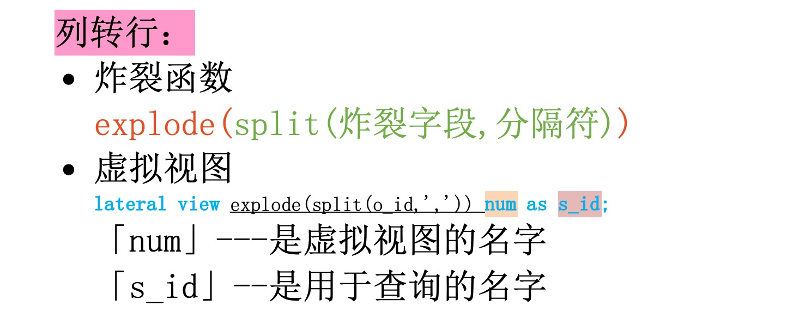

# 列转行---将一行某列的数据转到多行上

## 使用技术

### 炸裂函数

explode(split(炸裂字段,分隔符))

### 虚拟视图

**lateral view** explode(split(o_id,',')) **num** **as** **s_id** **;**

「num」---是虚拟视图的名字

「s_id」---是用于查询的名字



## 案例

### 数据

(u_id,o_id)

```
104408  2909888,2662805,2922438,674972,2877863,190237
104407  2982655,814964,1484250,2323912,2689723,2034331,1692373,677498,156562,2862492,338128
104406  1463273,2351480,1958037,2606570,3226561,3239512,990271,1436056,2262338,2858678
104405  153023,2076625,1734614,2796812,1633995,2298856,2833641,3286778,2402946,2944051,181577,464232
104404  1815641,108556,3110738,2536910,1977293,424564
104403  253936,2917434,2345879,235401,2268252,2149562,2910478,375109,932923,1989353
104402  3373196,1908678,291757,1603657,1807247,573497,1050134,3402420
104401  814760,213922,2008045,3305934,2130994,1602245,419609,2502539,3040058,2828163,3063469
104400  1609001,2986088,1795054,429550,1812893
104399  1715131,2105395,1758844,981085,2444143,1458638,968412
```

### 查询语句

```sql
select u_id,o_id,s_id
from datasss
lateral view explode(split(o_id,',')) num as s_id；
```

### 查询结果（部分）

(u_id    o_id    s_id)

```

104408  2909888,2662805,2922438,674972,2877863,190237   2909888
104408  2909888,2662805,2922438,674972,2877863,190237   2662805
104408  2909888,2662805,2922438,674972,2877863,190237   2922438
104408  2909888,2662805,2922438,674972,2877863,190237   674972
104408  2909888,2662805,2922438,674972,2877863,190237   2877863
104408  2909888,2662805,2922438,674972,2877863,190237   190237
104407  2982655,814964,1484250,2323912,2689723,2034331,1692373,677498,156562,2862492,338128     2982655
104407  2982655,814964,1484250,2323912,2689723,2034331,1692373,677498,156562,2862492,338128     814964
104407  2982655,814964,1484250,2323912,2689723,2034331,1692373,677498,156562,2862492,338128     1484250
104407  2982655,814964,1484250,2323912,2689723,2034331,1692373,677498,156562,2862492,338128     2323912
104407  2982655,814964,1484250,2323912,2689723,2034331,1692373,677498,156562,2862492,338128     2689723
104407  2982655,814964,1484250,2323912,2689723,2034331,1692373,677498,156562,2862492,338128     2034331
104407  2982655,814964,1484250,2323912,2689723,2034331,1692373,677498,156562,2862492,338128     1692373
104407  2982655,814964,1484250,2323912,2689723,2034331,1692373,677498,156562,2862492,338128     677498
104407  2982655,814964,1484250,2323912,2689723,2034331,1692373,677498,156562,2862492,338128     156562
104407  2982655,814964,1484250,2323912,2689723,2034331,1692373,677498,156562,2862492,338128     2862492
104407  2982655,814964,1484250,2323912,2689723,2034331,1692373,677498,156562,2862492,338128     338128
```

