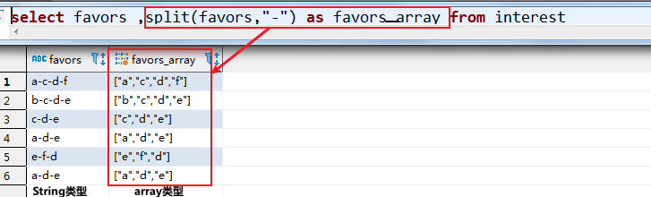

# 列转行

## 概念

​	把表中同一个key值对应的多个value列，转换为多行数据，使每一行数据中，保证一个key只对应一个value。（将一行某列的数据转到多行上）


## 使用技术

### 字符串函数-split

| 函数    | 用法              | 含义                        |
| ------- | ----------------- | --------------------------- |
| split() | split(favors,'-') | 将favors按照-分割成多部分。 |



### 炸裂函数-explode

| 函数      | 用法                              | 含义                                                   | 读音                        |
| --------- | --------------------------------- | ------------------------------------------------------ | --------------------------- |
| explode() | explode(array参数)                | 将array的值转到多行上                                  | `explode /ɪkˈsploʊd/ 爆炸 ` |
|           | explode(`split(炸裂字段,分隔符)`) | 和split组合使用，将String类型转为array，然后转到多行上 |                             |


### 虚拟视图-lateral view

- 读音：

`lateral /ˈlætərəl/ 侧面的 `

- 用法：

`LATERAL VIEW udtf(expression) tableAlias AS columnAlias` (',' columnAlias)

**lateral view** explode(split(favors,"-"))**t2 as favor**;

「t2」---是虚拟视图的名字

「favor」---是虚拟视图列别名


## 案例

### 数据

(city,infos)

```
北京	朝阳区,海淀区,其他
上海	黄浦区,徐汇区,其他
```

### 查询语句

```sql
-- 创建表并指定字段分隔符为逗号（\t）
create table city_infos(city string,infos string) row format delimited fields terminated by "\t";

-- 准备数据，放置在服务器文件系统或HDFS。此处放在服务器文件系统上（/root/yber/data/lines_data.txt）

-- 加载数据到表
load data local inpath "/root/yber/data/lines_data.txt" into table city_infos;

-- 查询数据
select city,t2.info 
from city_infos 
lateral view explode(split(infos,",")) t2 as info
```

### 查询结果

```
city	t2.info
北京	朝阳区
北京	海淀区
北京	其他
上海	黄浦区
上海	徐汇区
上海	其他
```

