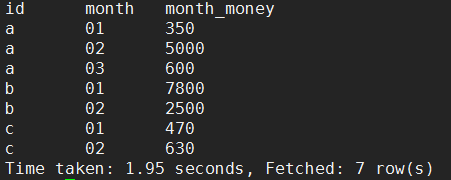
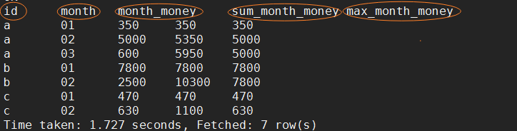
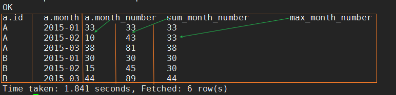
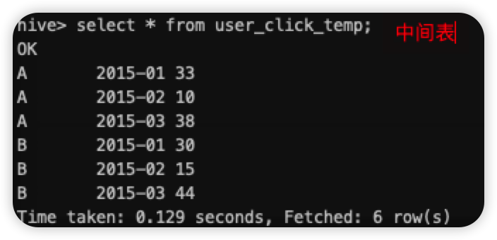
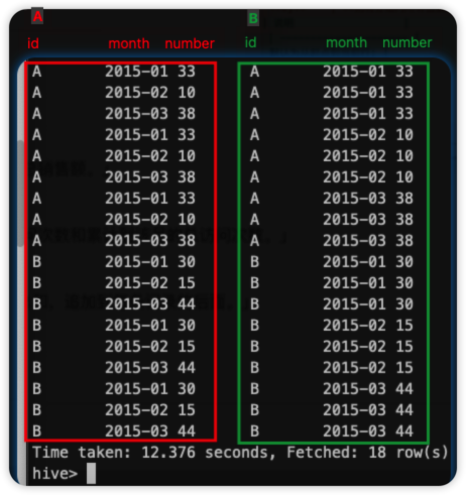
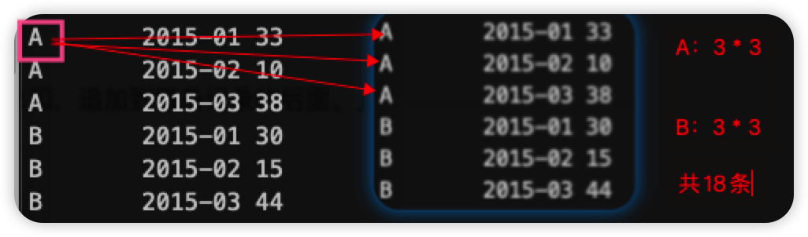
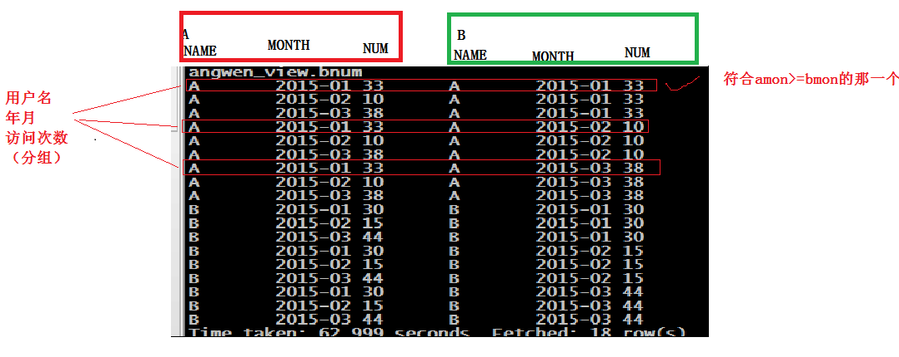
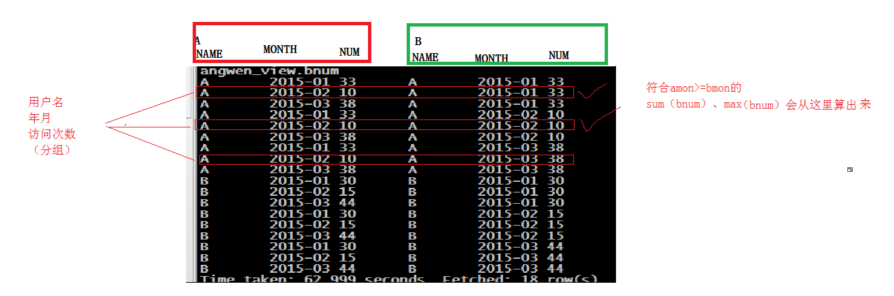

## 窗口分析

### 窗口函数——聚合「sum\max\min\avg」

以SUM为例子：（max、min、avg同理）

 sum(求和字段) over (partition by 分组字段 order by 排序字段 **rows between** <u>unbounded preceding</u> **and** <u>current row</u>) as pv1

| 关键字                  | 说明                  |
| ----------------------- | --------------------- |
| 如果不指定 rows between | 默认为从起点到当前行; |
| 如果不指定 order  by    | 则将分组内所有值累加; |

关键是理解ROWS BETWEEN含义,也叫做WINDOW子句：

| 关键字              | 说明                         |
| ------------------- | ---------------------------- |
| preceding：往前     | <u>3 preceding（前三行）</u> |
| following：往后     | <u>1 following</u>（后一行） |
| current row：当前行 | <u>current row</u>（当前行） |

| 关键字                      | 说明               |
| --------------------------- | ------------------ |
| <u>unbounded preceding.</u> | (表示从前面的起点) |
| <u>unbounded following</u>. | (表示到后面的终点) |

示例：

```sql
   sum(pv) over (partition by cookieid order by createtime rows between unbounded preceding and current row) as pv1, 
   sum(pv) over (partition by cookieid order by createtime) as pv2, 
   sum(pv) over (partition by cookieid) as pv3, 
   sum(pv) over (partition by cookieid order by createtime rows between 3 preceding and current row) as pv4, 
   sum(pv) over (partition by cookieid order by createtime rows between 3 preceding and 1 following) as pv5, 
   sum(pv) over (partition by cookieid order by createtime rows between current row and unbounded following) as pv6

```


<u>**注意看：几个示例的pv中 rows between 之后的内容 与 图片统计出来的结果。（多看几遍区别，多理解一下！！！）**</u>

### 第一道面试题

- 需求：编写Hive的HQL语句求出**每个店铺的当月销售额、累计到当月的总销售额、当月最大销售额**。

- 数据： (name，month，money)

  ```
  a,01,150
  a,01,200
  b,01,1000
  b,01,800
  c,01,250
  c,01,220
  b,01,6000
  a,02,2000
  a,02,3000
  b,02,1000
  b,02,1500
  c,02,350
  c,02,280
  a,03,350
  a,03,250
  ```

- 建表、导入数据

  ```sql
  -- 创建表并指定字段分隔符为逗号（，）
  create table shop(id string,month string,money int) row format delimited fields terminated by ",";
  
  -- 准备数据，放置在服务器文件系统或HDFS。此处放在服务器文件系统上（/root/yber/data/shop_data.txt）
  
  -- 加载数据到表
  load data local inpath "/root/yber/data/shop_data.txt" into table shop;
  ```

- 查询语句

  ```sql
  -- 分两步走：
  -- 第一步：sql得到每个店铺每个月的的销售额。
  SELECT
  id,MONTH,sum(money) AS month_money
  FROM shop
  GROUP BY id,MONTH;
  
  -- 第二步：从第一步的结果出发
  -- 利用sum开窗函数得到店铺当月累计总销售额
  -- 利用max开窗函数得到店铺当月最大销售额
  SELECT a.id,a.MONTH,a.month_money,
  sum(month_money) over(PARTITION BY a.id ORDER BY a.MONTH) AS sum_month_money,
  max(month_money) over(PARTITION BY a.id ORDER BY a.MONTH ROWS BETWEEN UNBOUNDED PRECEDING AND CURRENT row) AS max_month_money
  from
  (SELECT id,MONTH,sum(money) AS month_money FROM shop GROUP BY id,MONTH) a;
  ```

- 查询结果展示

  - 第一步：
  
  
  
  - 第二步（最终结果）：
  
  

### 第二道面试题

#### 1、开窗函数方法

- 需求：编写Hive的HQL语句求出**每个用户**截止到**每月**为止的**最大单月访问次数**和**累计到该月的总访问次数**

- 数据： (用户名，月份，访问次数)

  ```
  A,2015-01,5
  A,2015-01,15
  B,2015-01,5
  A,2015-01,8
  B,2015-01,25
  A,2015-01,5
  A,2015-02,4
  A,2015-02,6
  B,2015-02,10
  B,2015-02,5
  A,2015-03,16
  A,2015-03,22
  B,2015-03,23
  B,2015-03,10
  B,2015-03,11
  ```

- 要求结果展示

  ```
  用户	月份		当月访问次数	总访问次数	最大访问次数	
  A	2015-01		33			33			33
  A	2015-02		10			43			33
  A	2015-03		38			81			38
  B	2015-01		30			30			30
  B	2015-02		15			45			30
  B	2015-03		44			89			44
  ```

  

- 建表、导入数据

  ```sql
  -- 创建表并指定字段分隔符为逗号（，）
  create table user_click(id string,month string,number int) row format delimited fields terminated by ",";
  
  -- 准备数据，放置在服务器文件系统或HDFS。此处放在服务器文件系统上（/root/yber/data/user_click_data.txt）
  
  -- 加载数据到表
  load data local inpath "/root/yber/data/user_click_data.txt" into table user_click;
  ```

- 查询语句

  首先查询出每个用户当月访问的总次数

  ```sql
  SELECT id,MONTH,sum(number) AS month_number FROM user_click GROUP BY id,MONTH;
  ```

  然后在上一步的基础上，使用开窗函数

  ```sql
  SELECT 
  a.id,
  a.MONTH,
  a.month_number,
  sum(a.month_number) over(PARTITION BY a.id ORDER BY a.MONTH) AS sum_month_number,
  max(a.month_number) over(PARTITION BY a.id ORDER BY a.MONTH ROWS BETWEEN UNBOUNDED PRECEDING AND CURRENT ROW) AS max_month_number
  FROM 
  (SELECT id,MONTH,sum(number) AS month_number FROM user_click GROUP BY id,MONTH) a
  ```

- 查询结果展示

  ​	

#### 2、自连接视图方法（复杂、难用）

- 首先求出**每个用户的当月访问次数**，并存入中间表；

  ```sql
  -- 创建中转表 user_click_temp
  create table user_click_temp(id string,month string,number int)row format delimited fields terminated by ",";
  -- 将将初步查询的结果转入中转表(user_click_temp)中。
  insert into table user_click_temp select id,month,sum(number) from user_click group by id,month
  ```

  

- **创建**每个用户当月访问次数的**自连接视图（利用中转表）**

```sql
-- 创建自连接视图
create view user_click_view as select a.id aid,a.month amonth,a.number anumber,b.id bid,b.month bmonth,b.number bnumber from user_click_temp a inner join user_click_temp b on a.id=b.id;
-- 查询视图
select * from user_click_view;
```



- 查询语句

```sql
select 
aid,
amonth,
anumber,
max(bnumber) as max_number,
sum(bnumber) as sum_number 
from 
user_click_view 
where 
amonth >= bmonth 
group by 
aid,amonth,anumber;
```


说明（如图，演示了前两组的情况）：

1. 按照id相等的分组条件，自连接视图（user_click_view）将会有18条数据；
2. 利用where过滤出符合条件的一条或者多条
3. 聚合函数sum、max会选出符合条件的一条





### 第三道面试题

- 需求：编写Hive的HQL语句**按照day和mac分组，求出每组的销量累计总和，追加到每条记录的后面**

- 数据： (day,mac,color,num)

  ```
  20171011	1292	金色	1
  20171011	1292	金色	14
  20171011	1292	金色	2
  20171011	1292	金色	11
  20171011	1292	黑色	2
  20171011	1292	粉金	58
  20171011	1292	金色	1
  20171011	2013	金色	10
  20171011	2013	金色	9
  20171011	2013	金色	2
  20171011	2013	金色	1
  20171012	1292	金色	5
  20171012	1292	金色	7
  20171012	1292	金色	5
  20171012	1292	粉金	1
  20171012	2013	粉金	1
  20171012	2013	金色	6
  20171013	1292	黑色	1
  20171013	2013	粉金	2
  20171011	12460	茶花金	1
  ```

- 建表、导入数据

  ```sql
  -- 创建表并指定字段分隔符为制表符（\t）
  create table if not exists mac(day string, mac string,color string,number int) row format delimited fields terminated by "\t";
  
  -- 准备数据，放置在服务器文件系统或HDFS。此处放在服务器文件系统上（/opt/yber/data/mac.txt）
  
  -- 加载数据到表
  load data local inpath "/opt/zyb/data/mac.txt" into table mac;
  ```

- 查询语句

  ```sql
  select day,mac,color,number,sum(number) over(partition by day,mac order by day,mac) as sum_number from mac;
  ```

- 查询结果展示

  ```
  day     mac     color   num     sumnumber
  20171011        1292    金色    1       89
  20171011        1292    金色    14      89
  20171011        1292    金色    2       89
  20171011        1292    金色    11      89
  20171011        1292    黑色    2       89
  20171011        1292    粉金    58      89
  20171011        1292    金色    1       89
  20171011        2013    金色    2       22
  20171011        2013    金色    1       22
  20171011        2013    金色    9       22
  20171011        2013    金色    10      22
  20171011        12460   茶花金  1       1
  20171012        1292    金色    5       18
  20171012        1292    粉金    1       18
  20171012        1292    金色    5       18
  20171012        1292    金色    7       18
  20171012        2013    粉金    1       7
  20171012        2013    金色    6       7
  20171013        1292    黑色    1       1
  20171013        2013    粉金    2       2
  ```

  

### 