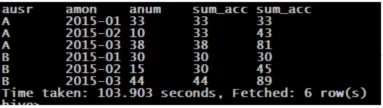
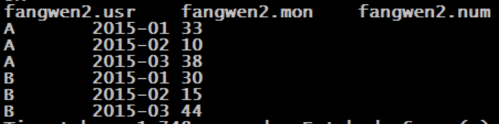
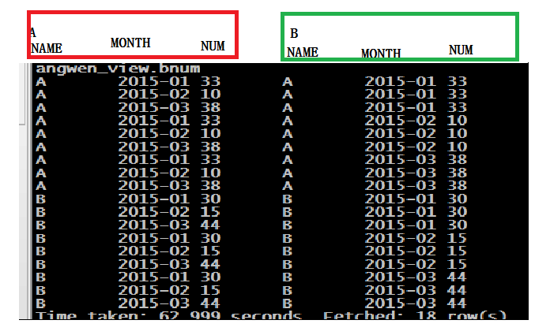

## 窗口分析

### 窗口函数——聚合「sum\max\min\avg」

以SUM为例子：（max、min、avg同理）

 sum(求和字段) over (partition by 分组字段 order by 排序字段 **rows between** <u>unbounded preceding</u> **and** <u>current row</u>) as pv1

| **如果不指定** **rows** **between** | **默认为从起点到当前行;** |
| ----------------------------------- | ------------------------- |
| **如果不指定** **order**  **by**    | **则将分组内所有值累加;** |

关键是理解ROWS BETWEEN含义,也叫做WINDOW子句：

| **preceding：往前**     | <u>3 preceding（前三行）</u>     |
| ----------------------- | -------------------------------- |
| **following：往后**     | **<u>1 following</u>（后一行）** |
| **current row：当前行** | **<u>current row</u>（当前行）** |

| **<u>unbounded preceding.</u>           (表示从前面的起点)** |      |
| ------------------------------------------------------------ | ---- |
| **<u>unbounded following</u>.           (表示到后面的终点)** |      |

示例：

```sql
   sum(pv) over (partition by cookieid order by createtime rows between unbounded preceding and current row) as pv1, 
   sum(pv) over (partition by cookieid order by createtime) as pv2, 
   sum(pv) over (partition by cookieid) as pv3, 
   sum(pv) over (partition by cookieid order by createtime rows between 3 preceding and current row) as pv4, 
   sum(pv) over (partition by cookieid order by createtime rows between 3 preceding and 1 following) as pv5, 
   sum(pv) over (partition by cookieid order by createtime rows between current row and unbounded following) as pv6

```


<u>**注意看，rows between 之后的内容与统计出来的结果。（多理解一下）**</u>

### 第一道面试题

- 需求：编写Hive的HQL语句求出每个店铺的当月销售额和累计到当月的总销售额

- 元数据. (name，month，money)

  ```
  a,01,150
  a,01,200
  b,01,1000
  b,01,800
  c,01,250
  c,01,220
  b,01,6000
  a,02,2000
  a,02,3000
  b,02,1000
  b,02,1500
  c,02,350
  c,02,280
  a,03,350
  a,03,250
  ```

- 建表、导入数据

  ```sql
  create table fangwen2(name string,mon string,monmoney int) row format delimited fields terminated by ",";
  
  load data local inpath "/home/hadoop/hivedata2/fangwen2" into table fangwen2;
  ```

- 查询语句

- ```sql
  select a.name,a.mon,a.monmoney,
  sum(a.monmoney) over(partition by a.name order by a.mon ) as summoney,
  max(a.monmoney) over(partition by a.name order by a.mon rows between unbounded preceding and current row) as maxmoney
  from
  (select name,mon,sum(money) as monmoney from sale group by name,mon) a;
  
  ```

- 查询结果展示

  

### 第二道面试题

#### 1、开窗函数方法

- 需求：编写Hive的HQL语句求出**每个用户**截止到**每月**为止的**最大单月访问次数**和**累计到该月的总访问次数**

- 元数据. (用户名，月份，访问次数)

  ```
  A,2015-01,5
  A,2015-01,15
  B,2015-01,5
  A,2015-01,8
  B,2015-01,25
  A,2015-01,5
  A,2015-02,4
  A,2015-02,6
  B,2015-02,10
  B,2015-02,5
  A,2015-03,16
  A,2015-03,22
  B,2015-03,23
  B,2015-03,10
  B,2015-03,11
  ```

- 要求结果展示

  ```
  用户	月份		最大访问次数	总访问次数		当月访问次数
  A	2015-01		33			33		  33
  A	2015-02		33			43		  10
  A	2015-03		38			81		  38
  B	2015-01		30			30		  30
  B	2015-02		30			45      15
  B	2015-03		44			89		  44
  ```

  

- 建表、导入数据

  说明：数据是放在了hdfs上的"/home/hadoop/fangwen.txt"中；

  ```sql
  create table fangwen(usr string,mon string,num int) row format delimited fields terminated by ",";
  
  load data local inpath "/home/hadoop/fangwen.txt" into table fangwen;
  ```

- 查询语句

  首先查询出每个用户当月访问的总次数

  ```sql
  select b.id as id, b.month as month, sum(b.pv) as pv from fangwen b group by b.id, b.month
  ```

  然后在上一步的基础上，使用开窗函数

- ```sql
  select 
  a.id, 
  a.month, 
  a.pv, 
  sum(a.pv) over (partition by a.id order by a.month ) as sumpv, 
  max(a.pv) over (partition by a.id order by a.month rows between unbounded preceding and current row) as maxpv 
  from 
  (select b.id as id, b.month as month, sum(b.pv) as pv from fangwen b group by b.id, b.month) a; 
  ```

- 查询结果展示

  说明：

  1、图片中表头没有正确对照「名字最早查询也没有规范」

  2、当时没有使用开窗函数（下面会讲另一种方式）

  其实分别代表的是-->id、month、pv、maxpv、sumpv

  ​	

#### 2、自连接视图方法（复杂、难用）

- ​	首先求出**每个用户的当月访问次数**，并存入中转表；

  ```sql
  //创建中转表
  create table fangwen2(usr string,mon string,num int)row format delimited fields terminated by ",";
  //将将初步查询的结果转入中转表中。
  insert into table fangwen2 select usr,mon,sum(num) from fangwen group by usr,mon
  ```

  

- **创建**每个用户当月访问次数的**自连接视图（中转表）**

```sql
//创建自连接视图
create view fangwen_view as select a.usr ausr,a.mon amon,a.num anum,b.usr busr,b.mon bmon,b.num bnum from fangwen2 a inner join fangwen2 b on a.usr=b.usr;
//查询视图
select * from fangwen2_view;
```



- 查询语句

```sql
select 
ausr,
amon,
anum,
max(bnum) as max_acc,
sum(bnum) as sum_acc 
from 
fangwen_view 
where 
amon>=bmon 
group by 
ausr,amon,anum;
```


说明（如图，演示了前两组的情况）：

1. 按照分组条件，自连接视图（fangwen2_view）的18条数据被分为6组
2. png/面试题2_5.png利用where过滤出符合条件的一条或者多条
3. 聚合函数sum、max会选出符合条件的一条


