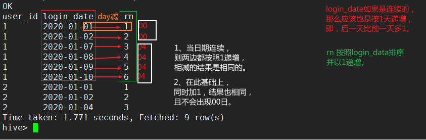

## 窗口分析2 lag/lead

### 窗口函数——上下「lag/lead」

#### LAG(col,n,DEFAULT) 用于统计窗口内**往上**第n行值

> 第一个参数为列名，
> 第二个参数为往上第n行（可选，默认为1），
> 第三个参数为默认值（当往上第n行为NULL时候，取默认值，如不指定，则为NULL）

#### LEAD(col,n,DEFAULT) 用于统计窗口内**往下**第n行值

> 第一个参数为列名，
> 第二个参数为往下第n行（可选，默认为1），
> 第三个参数为默认值（当往下第n行为NULL时候，取默认值，如不指定，则为NULL）

### 日期函数

这两个函数日期均只能为<u>'yyyy-MM-dd'格式 & 'yyyy-MM-dd HH:mm:ss'格式</u>

#### datediff(endDate, startDate)

返回endDate和startDate相差的天数。

#### date_add（start_date, num_days）

返回初始日期n天后（负数为之前）的日期。

### 第一道面试题

- 需求：编写Hive的HQL语句**<u>求出连续三天登陆的用户id</u>**

- 数据：(user_id，login_date)

  ```sql
  -- 创建表，并导入数据
  create table login_log as
  select 1 as user_id, "2020-01-01" as login_date
  union all
  select 1 as user_id, "2020-01-02" as login_date
  union all
  select 1 as user_id, "2020-01-07" as login_date
  union all
  select 1 as user_id, "2020-01-08" as login_date
  union all
  select 1 as user_id, "2020-01-09" as login_date
  union all
  select 1 as user_id, "2020-01-10" as login_date
  union all
  select 2 as user_id, "2020-01-01" as login_date
  union all
  select 2 as user_id, "2020-01-02" as login_date
  union all
  select 2 as user_id, "2020-01-04" as login_date
  ```

- 查看表数据

  ```sql
  hive> select * from login_log;
  OK
  1	2020-01-01
  1	2020-01-02
  1	2020-01-07
  1	2020-01-08
  1	2020-01-09
  1	2020-01-10
  2	2020-01-01
  2	2020-01-02
  2	2020-01-04
  ```

#### 1、lag/lead函数+datediff方法

思路：

1. 通过lag/lead函数，将每个用户ID记录的上一条时间、下一条时间汇总到一条数据中（形如A）；
2. 然后利用datediff函数计算本条与上一条时间差、下一条与本条时间差，两个差同时为1表示三天递增，即：连续三天登录。（形如B）；
3. 最后对结果去重即可。

- 查询语句（第一步）

  ```sql
  -- A 首先查询 该记录的用户ID、上一条时间、本条时间、下一条时间。
  SELECT 
  user_id,
  -- lag(login_data) 也可以，因为第二个参数可选，默认为1
  lag(login_date,1) over(PARTITION BY user_id ORDER BY login_date) AS lag_date, 
  login_date,
  -- lead(login_data) 也可以，因为第二个参数可选，默认为1
  lead(login_date,1) over(PARTITION BY user_id ORDER BY login_date) AS lead_date
  FROM login_log;
  ```

    A:

  ```
  1	NULL		2020-01-01	2020-01-02
  1	2020-01-01	2020-01-02	2020-01-07
  1	2020-01-02	2020-01-07	2020-01-08
  1	2020-01-07	2020-01-08	2020-01-09
  1	2020-01-08	2020-01-09	2020-01-10
  1	2020-01-09	2020-01-10	NULL
  2	NULL		2020-01-01	2020-01-02
  2	2020-01-01	2020-01-02	2020-01-04
  2	2020-01-02	2020-01-04	NULL
  ```

- 查询语句（第二步）

  ```sql
  -- B 使用datediff函数判断过滤（当前日期和前一天日期差一天、当前日期和后一天日期差一天），说明为连续三天登陆
  -- datediff()函数，注意用新的一天减去旧的一天
  SELECT 
    a.user_id
  FROM (
    SELECT 
    user_id,
    lag(login_date,1) over(PARTITION BY user_id ORDER BY login_date) AS lag_date,
    login_date,
    lead(login_date,1) over(PARTITION BY user_id ORDER BY login_date) AS lead_date
    FROM login_log
  ) a
  WHERE datediff(login_date,lag_date)=1 AND datediff(lead_date,login_date) =1
  ```

  B:

  ```
  1
  1
  ```

- 最后通过distinct **或者** group by去重即可。

  ```sql
  SELECT 
  DISTINCT a.user_id -- 这里通过distinct去重。
  FROM (
  SELECT 
  user_id,
  lag(login_date,1) over(PARTITION BY user_id ORDER BY login_date) AS lag_date,
  login_date,
  lead(login_date,1) over(PARTITION BY user_id ORDER BY login_date) AS lead_date
  FROM login_log
  ) a
  WHERE datediff(login_date,lag_date)=1 AND datediff(lead_date,login_date) =1
  ```

  最终结果：

  ```
  1
  ```

#### 2、date_add方法+row_number函数

思路：

1. 利用row_number函数得到每个用户ID，按照日期排序的递增排名；
   - 这里row_number得到一个以1递增的序列，日期如果连续也会是一个以1天递增的序列（如下图1：查询第二步）。
   - 当用户ID的日期连续时（即，该用户连续登陆），则两个都以1递增的相减得到的数应该相同（如下图1：查询第二步）。
2. 利用相减结果得到

- 查询语句（第一步【row_number】）

首先查询出每个用户id、登陆日期、登陆日期排名（row_number）

```sql
SELECT 
user_id,
login_date,
row_number() over(PARTITION BY user_id ORDER BY login_date) AS rn -- row_number无参数，不要跟其他窗口函数混淆
FROM login_log;
```

结果：

```
1	2020-01-01	1
1	2020-01-02	2
1	2020-01-07	3
1	2020-01-08	4
1	2020-01-09	5
1	2020-01-10	6
2	2020-01-01	1
2	2020-01-02	2
2	2020-01-04	3
```

- 查询语句（第二步【date_add函数】）

获取user_id,login_date,**归一化日期（如果用户是连续登陆，这个日期是同一天）**【如下图所示】。



```sql
SELECT 
  a.user_id,
  a.login_date, 
  date_add(a.login_date,1-rn) AS con_date -- 这里相当执行了(day 减 rn 加 1) ，上图白色字体1、2.
FROM (
  SELECT 
  user_id,
  login_date,
  row_number() over(PARTITION BY user_id ORDER BY login_date) AS rn -- row_number无参数，不要跟其他窗口函数混淆
  FROM login_log
) a
```

  结果：

```
a.user_id	a.login_date	con_date
1	2020-01-01	2020-01-01
1	2020-01-02	2020-01-01
1	2020-01-07	2020-01-05
1	2020-01-08	2020-01-05
1	2020-01-09	2020-01-05
1	2020-01-10	2020-01-05
2	2020-01-01	2020-01-01
2	2020-01-02	2020-01-01
2	2020-01-04	2020-01-02
```

- 最终结果（最后，聚合得到id和连续登陆日期）。

```sql
SELECT b.user_id,b.con_date,count(*) AS login_number
FROM (
SELECT 
  a.user_id,
  a.login_date, 
  date_add(a.login_date,1-rn) AS con_date -- 这里相当执行了(day 减 rn 加 1) ，上图白色字体1、2.
FROM (
  SELECT 
  user_id,
  login_date,
  row_number() over(PARTITION BY user_id ORDER BY login_date) AS rn -- row_number无参数，不要跟其他窗口函数混淆
  FROM login_log
) a
) b
GROUP BY b.user_id,b.con_date;
```

查询结果展示

```sql
-- 1、3列即为我们需要的结果。
1	2020-01-01	2
1	2020-01-05	4
2	2020-01-01	2
2	2020-01-02	1
```


有时间继续思考，没有先跳过。

附加内容： 进阶！！！

附加内容： 进阶！！！

附加内容： 进阶！！！

```sql
SELECT 
b.user_id,
min(b.login_date) over(PARTITION BY b.user_id,b.con_date) AS first_date,
sum(b.constant) over(PARTITION BY b.user_id,b.con_date) AS login_number -- 附加2：在这里对常数进行sum窗口计数
FROM (
SELECT 
  a.user_id,
  a.login_date, 
  date_add(a.login_date,1-rn) AS con_date ,-- 这里相当执行了(day 减 rn 加 1) ，上图白色字体1、2.
  1 AS constant -- 附加1：在这里添加一个常数
FROM (
  SELECT 
  user_id,
  login_date,
  row_number() over(PARTITION BY user_id ORDER BY login_date) AS rn -- row_number无参数，不要跟其他窗口函数混淆
  FROM login_log
) a
) b
```

结果：（中间的日期也是有用的，表示连续登录的第一天日期）。后续可以根据需要去重等比如`select 后添加 distinct`。

```sql
-- 1、2、3列都是有用的结果！！！
b.user_id	first_date	login_number
1	2020-01-01	2
1	2020-01-01	2
1	2020-01-07	4
1	2020-01-07	4
1	2020-01-07	4
1	2020-01-07	4
2	2020-01-01	2
2	2020-01-01	2
2	2020-01-04	1
```

distinct去重

```sql
SELECT 
distinct -- 去重
b.user_id,
min(b.login_date) over(PARTITION BY b.user_id,b.con_date) AS first_date,
sum(b.constant) over(PARTITION BY b.user_id,b.con_date) AS login_number
FROM (
SELECT 
  a.user_id,
  a.login_date, 
  date_add(a.login_date,1-rn) AS con_date ,-- 这里相当执行了(day 减 rn 加 1) ，上图白色字体1、2.
  1 AS constant
FROM (
  SELECT 
  user_id,
  login_date,
  row_number() over(PARTITION BY user_id ORDER BY login_date) AS rn -- row_number无参数，不要跟其他窗口函数混淆
  FROM login_log
) a
) b

```

结果：

```sql
b.user_id	first_date	login_number
1	2020-01-01	2
1	2020-01-07	4
2	2020-01-01	2
2	2020-01-04	1
```

