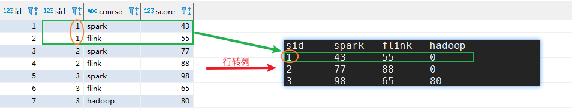
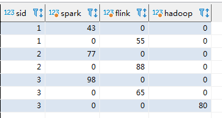
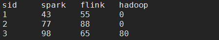
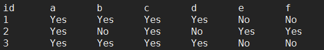

# 行列转换

## 概念

### 行转列

​	把数据表中具有<u>相同key值的多行value数据（左侧）</u>，**转换为**使用<u>一个key值的多列数据（右侧）</u>；使每一行数据中，一个key对应多个value。



## 函数

### case···when···then···else···end语句

[一片文章，学习一下。](https://blog.csdn.net/konglongaa/article/details/80250253)


### collect_set()、collect_list()

| 函数               | 作用                               |
| ------------------ | ---------------------------------- |
| collect_set(字段)  | 求出该字段的所有值（不重复，去重） |
| collect_list(字段) | 求出该字段的所有值（存在重复）     |

[它们都是将分组中的某列转为一个数组返回，不同的是collect_list不去重而collect_set去重。](https://www.cnblogs.com/cc11001100/p/9043946.html)


### array_contains()、if()

| 函数                               | 作用                                     |
| ---------------------------------- | ---------------------------------------- |
| array_contains(数组，判断包含字段) | 包含返回true，否则返回false              |
| if ( boolean, true返回，false返回) | 判断条件为true返回第一个条件，否则第二个 |


## 第四道面试题

### 需求、数据、建表等

- 需求：编写Hive的HQL语句求出**所有flink课程成绩 大于 spark课程成绩的学生的学号**

- 数据： (序号-id，学号-sid，课程-course，分数-score)

  ```
  2,1,flink,55
  3,2,spark,77
  4,2,flink,88
  5,3,spark,98
  6,3,flink,65
  7,3,hadoop,80
  ```
  
- 建表、导入数据

  ```sql
  -- 创建表并指定字段分隔符为逗号（，）
  create table student_score(id int,sid int,course string,score int) row format delimited fields terminated by ",";
  
  -- 准备数据，放置在服务器文件系统或HDFS。此处放在服务器文件系统上（/root/yber/data/student_score_data.txt）
  
  -- 加载数据到表
  load data local inpath "/root/yber/data/student_score_data.txt" into table student_score;
  ```

### 思路与实现步骤

- 思路

**原数据格式**是：每行一个学号，对应一课的成绩「即一个学生的多个科目与成绩对应在不同行」

```
id	sid	course	score
1	1	spark	43
2	1	flink	55
3	2	spark	77
4	2	flink	88
5	3	spark	98
6	3	flink	65
7	3	hadoop	80
```

如果能够将一个学生的<u>多个科目成绩转换到一行</u>「即**行转列**」

```
sid	spark	flink	hadoop
1	43		55		0
2	77		88		0
3	98		65		80
```

那么，我们可以通过

```sql
select sid from student_score where spark<flink;
```

- 实现步骤

  - case when then else end语句

    1. 使用case···when，将学生各科成绩列举在同一行数据

       ```sql
       
       select 
       sid,
       -- 当course字段的值为spark的时候。 新字段spark的值，就是score，否则就是0
       case when course="spark" then score else 0 end as spark,
       case when course="flink" then score else 0 end as flink,
       case when course="hadoop" then score else 0 end as hadoop
       from 
       student_score ;
       ```

       

    2. 在通过sid分组、并将case查询到的各科成绩通过max聚合。(对比第一步多了group by+max)

       ```sql
       select 
       sid,
       max(case when course="spark" then score else 0 end) as spark,
       max(case when course="flink" then score else 0 end) as flink,
       max(case when course="hadoop" then score else 0 end) as hadoop
       from 
       student_score 
       group by sid;
       ```

       

    3. 最后在这个查询基础上，我们在进行对spark小于flink的判断即可。

       ```sql
       select a.sid from (
       select 
       sid,
       max(case when course="spark" then score else 0 end) as spark,
       max(case when course="flink" then score else 0 end) as flink,
       max(case when course="hadoop" then score else 0 end) as hadoop
       from 
       student_score 
       group by sid
       ) a
       where a.flink > a.spark
       ;
       ```
       
       结果：
       
       ```
       1
       2
       ```


## 第五道面试题

### 需求、数据、建表等

- 需求：

  ​	有id为1,2,3的学生选修了课程a,b,c,d,e,f中其中几门。

  ​	**编写Hive的HQL语句来实现以下结果：表中的Yes表示选修，表中的No表示未选修**

  

- 元数据. (id course )

  ```
  1,a
  1,b
  1,c
  1,e
  2,a
  2,c
  2,d
  2,f
  3,a
  3,b
  3,c
  3,e
  ```

- 建表、导入数据

  ```sql
  -- 创建表并指定字段分隔符为逗号（，）
  create table if not exists id_course(id int, course string) row format delimited fields terminated by ",";
  
  -- 准备数据，放置在服务器文件系统或HDFS。此处放在服务器文件系统上（/root/yber/data/id_course_data.txt）
  
  -- 加载数据到表
  load data local inpath "/root/yber/data/id_course_data.txt" into table id_course;
  ```

### 实现步骤

- 第一步：列出<u>所有的课程</u>

  **collect_set函数用法见开头！！！**

  **collect_set函数用法见开头！！！**

  **collect_set函数用法见开头！！！**

  ```sql
  -- 使用 collect_set函数 获取不重复的所有课程。
  select collect_set(course) as courses from id_course;
  ```

  结果：

  ```
  courses
  ["a","b","c","e","d","f"]
  ```

- 第二步：列出<u>每个id学修的课程</u>

  ```sql
  -- 获取每个id选择的课程
  select id,collect_set(course) as user_course from id_course group by id;
  ```

  结果：

  ```
  id	user_course
  1	["a","b","c","e"]
  2	["a","c","d","f"]
  3	["a","b","c","e"]
  ```

- 第三步：组合前两步的查询结果（join）

  ```sql
  -- Set
  -- 该属性不允许笛卡尔积，设置为false代表开启笛卡尔积。
  set hive.strict.checks.cartesian.product=false;
  -- 设置本地运行(学习测试时，运行的更快。)
  set hive.exec.mode.local.auto=true;
  ```

  ```sql
  select t1.id,t1.user_course,t2.courses from 
  (select id,collect_set(course) as user_course from id_course group by id) t1
  join 
  (select collect_set(course) as courses from id_course) t2
  ```

  结果：

  ```
  t1.id	t1.user_course		t2.courses
  1		["a","b","c","e"]	["a","b","c","e","d","f"]
  2		["a","c","d","f"]	["a","b","c","e","d","f"]
  3		["a","b","c","e"]	["a","b","c","e","d","f"]
  ```

- 第四步：得出最终结果：拿出courses字段中的每一个元素在user_course中进行判断，看是否存在。

  **array_contains函数用法见开头！！！**

  **array_contains函数用法见开头！！！**

  **array_contains函数用法见开头！！！**

  ```sql
  -- 这一步结果已经可以看出学生选修情况。
  select 
  aa.id as id,
  -- 注意这里是遍历所有课程（0-5,对应课程a～f），分别判断用户是否选修。（函数的参数不要弄反了！）
  ARRAY_CONTAINS(aa.user_course,aa.courses[0]) as a ,
  ARRAY_CONTAINS(aa.user_course,aa.courses[1]) as b ,
  ARRAY_CONTAINS(aa.user_course,aa.courses[2]) as c ,
  ARRAY_CONTAINS(aa.user_course,aa.courses[3]) as d ,
  ARRAY_CONTAINS(aa.user_course,aa.courses[4]) as e ,
  ARRAY_CONTAINS(aa.user_course,aa.courses[5]) as f 
  from ( 
  select 
  t1.id as id,
  t1.user_course as user_course ,
  t2.courses as courses
  from 
  (select id,collect_set(course) as user_course from id_course group by id) t1
  join 
  (select collect_set(course) as courses from id_course) t2
  ) aa
  ```

  结果：

  ```
  id	a			b			c			d			e			f
  1		true	true	true	true	false	false
  2		true	false	true	false	true	true
  3		true	true	true	true	false	false
  ```

- 利用if函数，规范为题目要求的结果即可。

  **if函数用法见开头！！！**

  **if函数用法见开头！！！**

  **if函数用法见开头！！！**

  ```sql
  select 
  aa.id as id,
  -- 与上一步不同的地方仅仅是使用了if函数，规范要求的结果。
  -- array_contains函数返回的true，false；
  -- 通过if函数将返回结果规范为Yes，No；
  if(ARRAY_CONTAINS(aa.user_course,aa.courses[0]),"Yes","No") as a ,
  if(ARRAY_CONTAINS(aa.user_course,aa.courses[1]),"Yes","No") as b ,
  if(ARRAY_CONTAINS(aa.user_course,aa.courses[2]),"Yes","No") as c ,
  if(ARRAY_CONTAINS(aa.user_course,aa.courses[3]),"Yes","No") as d ,
  if(ARRAY_CONTAINS(aa.user_course,aa.courses[4]),"Yes","No") as e ,
  if(ARRAY_CONTAINS(aa.user_course,aa.courses[5]),"Yes","No") as f 
  from ( 
  select 
  t1.id as id,
  t1.user_course as user_course ,
  t2.courses as courses
  from 
  (select id,collect_set(course) as user_course from id_course group by id) t1
  join 
  (select collect_set(course) as courses from id_course) t2
  ) aa
  ```

  结果：

  ```
  id	a	b	c	d	e	f
  1	Yes	Yes	Yes	Yes	No	No
  2	Yes	No	Yes	No	Yes	Yes
  3	Yes	Yes	Yes	Yes	No	No
  ```

  


