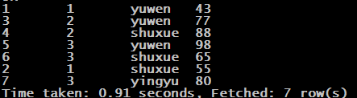
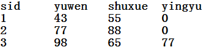
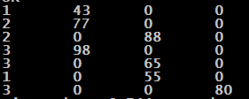
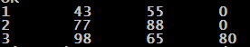
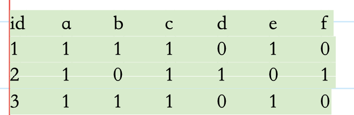

### 第四道面试题

#### 需求、数据、建表等

- 需求：编写Hive的HQL语句求出**所有数学课程成绩 大于 语文课程成绩的学生的学号**

- 元数据. (序号-id，学号-sid，课程-course，分数-score)

  ```
  1,1,yuwen,43
  2,1,shuxue,55
  3,2,yuwen,77
  4,2,shuxue,88
  5,3,yuwen,98
  6,3,shuxue,65
  7,3,yingyu,80
  ```

- 建表、导入数据

  ```sql
  create table chengji(id int,sid int,course string,score int) row format delimited fields terminated by ",";
  
  load data local inpath "/home/hadoop/hivedata2/chengji.txt" into table chengji;
  ```

#### 思路与实现步骤

- 思路

  **原数据格式**是：每行一个学号，对应一课的成绩「即一个学生的多个科目与成绩对应在不同行」



​		如果能够将一个学生的<u>多个科目成绩转换到一行</u>「即**行转列**」



```sql
	那么，我们可以通过

	select sid from course1 where yuwen<shuxue;

	来完成查询操作.
```

- 实现步骤

  case when then else end语句

  1. 使用case···when，将学生各科成绩列举在同一行数据

     ```sql
     select 
     sid, 
     -- 当course字段的值为yuwen的时候。 新字段yuwen的值，就是score，否则就是0
     (case course when "yuwen" then score else 0 end) as yuwen, 
     (case course when "shuxue" then score else 0 end) as shuxue, 
     (case course when "yingyu" then score else 0 end) as yingyu 
     from course；
     ```

     

  2. 在通过sid分组、并将case查询到的各科成绩通过max聚合。(对比第一步多了group by+max)

     ```sql
     select 
     sid, 
     -- 当course字段的值为yuwen的时候。 新字段yuwen的值，就是score，否则就是0
     max(case course when "yuwen" then score else 0 end) as yuwen, 
     max(case course when "shuxue" then score else 0 end) as shuxue, 
     max(case course when "yingyu" then score else 0 end) as yingyu 
     from course group by sid;
     ```

     

  3. 最后在这个查询基础上，我们在进行对语文小于数学的判断即可。

     ```sql
     select a.sid from (
     select sid, 
     -- 当course字段的值为yuwen的时候。 新字段yuwen的值，就是score，否则就是0
     max(case course when "yuwen" then score else 0 end) as yuwen, 
     max(case course when "shuxue" then score else 0 end) as shuxue, 
     max(case course when "yingyu" then score else 0 end) as yingyu 
     from course group by sid
     ) a where yuwen < shuxue;
     ```

- 最终查询语句

- ```sql
  select a.sid from (
  select sid, 
  -- 当course字段的值为yuwen的时候。 新字段yuwen的值，就是score，否则就是0
  max(case course when "yuwen" then score else 0 end) as yuwen, 
  max(case course when "shuxue" then score else 0 end) as shuxue, 
  max(case course when "yingyu" then score else 0 end) as yingyu 
  from course group by sid
  ) a where yuwen < shuxue;
  ```

- 查询结果展示

  ​	省略。。。

#### case···when···then···else···end语句

[	csdn上关于这个的细致讲解，非常不错！](https://blog.csdn.net/konglongaa/article/details/80250253)

### 第五道面试题

#### 需求、数据、建表等

- 需求：

  ​	有id为1,2,3的学生选修了课程a,b,c,d,e,f中其中几门。

  ​	编写Hive的HQL语句来实现以下结果：表中的1表示选修，表中的0表示未选修

  

  

- 元数据. (id course )

  ```
  1,a
  1,b
  1,c
  1,e
  2,a
  2,c
  2,d
  2,f
  3,a
  3,b
  3,c
  3,e
  ```

- 建表、导入数据

  ```sql
  create table if not exists id_course(id int, course string) row format delimited fields terminated by ",";
  
  load data local inpath "/home/hadoop/id_course.txt" into table id_course;
  ```

#### 实现步骤

- 第一步：列出所有的课程

```sql
select collect_set(course) as courses from id_course;
```

| 函数              | 作用                         |
| ----------------- | ---------------------------- |
| collect_set(字段) | 求出该字段的所有值（不重复） |

​		结果：

​		["a","b","c","e","d","f"]

-  第二步：列出每个id学修的课程

```sql
		select id, collect_set(course) as courses from id_course group by id;
```

​		结果：

​		1      ["a","b","c","e"]

​		2      ["a","c","d","f"]

​		3      ["a","b","c","e"]

```
设置
//该属性不允许笛卡尔积，设置为false代表开启笛卡尔积。
set hive.strict.checks.cartesian.product=false;
//设置本地运行
set hive.exec.mode.local.auto=true;
```

- 第三步：组合前两步的查询结果（join）

```sql
create table id_courses as select t1.id as id,t1.course as id_courses,t2.course courses 

from 

(select id as id,collect_set(course) as course from id_course group by id ) t1 

join 

(select collect_set(course) as course from id_course) t2; 
```

​		结果：id_courses表

​		id        id_courses                        courses

​		1      ["a","b","c","e"]      ["a","b","c","e","d","f"]

​		2      ["a","c","d","f"]      ["a","b","c","e","d","f"]

​		3      ["a","b","c","e"]      ["a","b","c","e","d","f"]

 

 

- 第四步：

  得出最终结果：拿出course字段中的每一个元素在id_courses中进行判断，看是否存在。

 ```sql
select 

aa.id,

if(array_contains(aa.mycourses, aa.totalcourses[0]), 1, 0) as a,

if(array_contains(aa.mycourses, aa.totalcourses[1]), 1, 0) as b,

if(array_contains(aa.mycourses, aa.totalcourses[2]), 1, 0) as c,

if(array_contains(aa.mycourses, aa.totalcourses[3]), 1, 0) as d,

if(array_contains(aa.mycourses, aa.totalcourses[4]), 1, 0) as e,

if(array_contains(aa.mycourses, aa.totalcourses[5]), 1, 0) as f 

from(

select a.id, a.courses as mycourses, b.totalcourses as totalcourses

from

(select id, collect_set(course) as courses from id_course group by id) a

join

(select collect_set(course) as totalcourses from id_course) b

) aa;
 ```

​		结果：
​		id	a	b	c	d	e	f

​		1       1      1       1       1      0       0

​		2       1      0       1       0      1       1

​		3       1      1       1       1      0       0

#### array_contains()、if()

| 函数                               | 作用                                     |
| ---------------------------------- | ---------------------------------------- |
| array_contains(数组，判断包含字段) | 包含返回true，否则返回false              |
| if ( boolean, true返回，false返回) | 判断条件为true返回第一个条件，否则第二个 |

#### collect_set()、collect_list()

[它们都是将分组中的某列转为一个数组返回，不同的是collect_list不去重而collect_set去重。](https://www.cnblogs.com/cc11001100/p/9043946.html)

